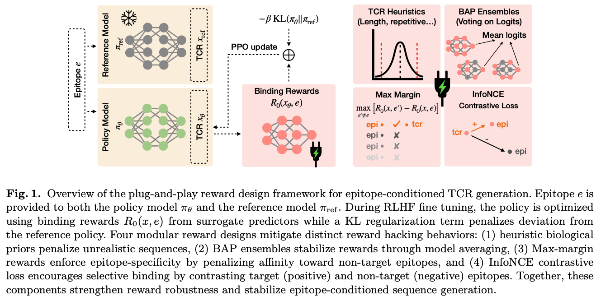
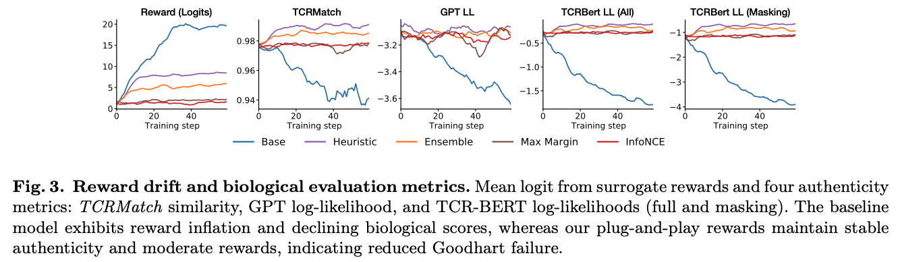
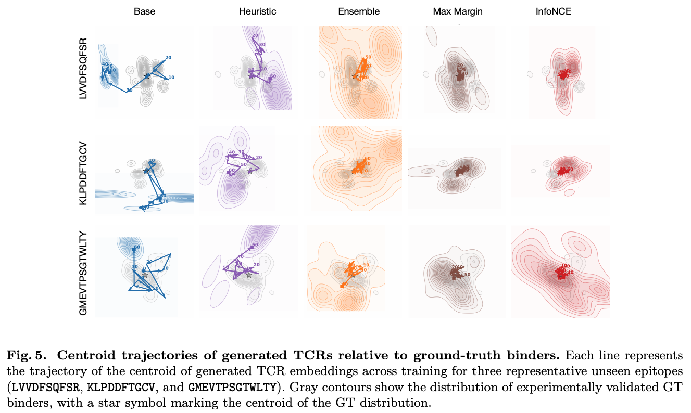
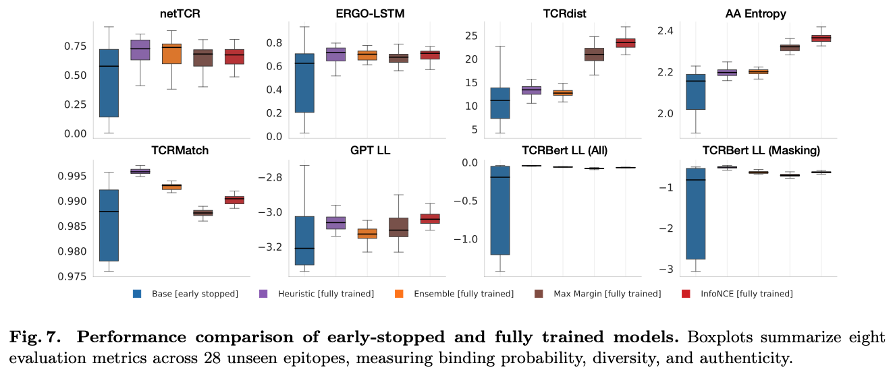

# Mitigating Goodhart's Law in Epitope-Conditioned TCR Generation Using Plug-and-Play Reward Designs

Code Release for RECOMB Submission

This repository contains the full codebase used in our RECOMB submission **“Mitigating Goodhart's Law in Epitope-Conditioned TCR Generation Using Plug-and-Play Reward Designs”**.  
It includes:

- Reinforcement learning training code  
- Reward model definitions and scoring functions  
- Reproducible evaluation pipeline  
- Data used in experiments  
- Figures for the paper  


---

## 📜 Abstract

Epitope-conditioned T cell receptor (TCR) generation extends protein language modeling to therapeutic design of TCRs, with recent works demonstrating improved performance using reinforcement learning (RL) post-training utilizing surrogate models. However, such frameworks suffer from Goodhart’s Law: optimizing imperfect surrogate rewards leads to reward hacking and biologically invalid sequences. We present a plug-and-play reward design framework that mitigates reward hacking without altering the generator and its training pipeline. The framework integrates multiple complementary strategies: heuristic biological priors to reject degenerate sequences, model ensembling to reduce per-model biases, and binding-specificity objectives to suppress cross-epitope overfitting and promote target-focused binding behavior. When applied to the RL-based fine-tuning process of TCR generators, these rewards stabilize optimization, preserve sequence diversity, and yield generations that are more biologically aligned with real TCR sequences. The resulting models produce more authentic epitope-specific receptors, demonstrating that our Goodhart-resistant reward design substantially improves reliability and controllability in biologically grounded sequence generation.


---

## 📊 Main Results

Our reward hacking mitigation strategies improve RL stability, reduce unrealistic reward exploitation, and preserve biologically meaningful structures in the generated TCRs.


---

### **Our Plug-and-Play Reward Design Framework for Epitope-Conditioned TCR Generation**

<p align="center">
  
  <br/>
  <em>
  Overview of the plug-and-play reward design framework for epitope-conditioned TCR generation. 
  Reward components include heuristic priors, surrogate binding rewards, ensemble stabilization, 
  max-margin epitope specificity, and InfoNCE contrastive losses. Together, these modules reduce 
  reward hacking and stabilize RL-based sequence generation.
  </em>
</p>

---

### **Plug-and-Play Reward Design Mitigates Reward Hacking**

<p align="center">
  
  <br/>
  <em>
  Reward drift and biological authenticity metrics across training. 
  The baseline RL model exhibits reward inflation and degraded biological scores 
  (TCRMatch similarity, GPT log-likelihood, TCR-BERT log-likelihood). 
  Our reward designs maintain stable authenticity and moderate rewards, 
  demonstrating reduced Goodhart failure and improved robustness.
  </em>
</p>

---

### **Reward Designs Stabilize Distributional Trajectories during TCR Generation**

<p align="center">
  
  <br/>
  <em>
  Centroid trajectories of generated TCR embeddings across training for multiple epitopes. 
  Baseline RL collapses toward unrealistic or off-manifold regions, while our reward 
  designs maintain stable trajectories that remain anchored to the ground-truth 
  TCR distribution. Mitigation strategies significantly improve distributional stability 
  and epitope-specific structure.
  </em>
</p>

---

### **Delaying Goodhart’s Failure Enables Stable Learning and Better Generalization**

<p align="center">
  
  <br/>
  <em>
  Comparison of early-stopped baseline RL and fully-trained models with reward hacking 
  mitigation. Fully trained models, when equipped with stabilization strategies, 
  maintain biological diversity, authenticity, and binding properties across 28 
  unseen epitopes. This illustrates that delaying failure enables stable learning 
  and better generalization.
  </em>
</p>

---

## 🚀 Model Training and Eval

### 🔧 RL Environment

```bash
git clone https://github.com/Lee-CBG/TCRRobustRewardDesign
cd TCRRobustRewardDesign

conda create -n tcr_env python=3.10 -y
conda activate tcr_env

pip install wandb==0.18.3 \
            torch==2.0.1+cu117 \
            pandas==2.2.2 \
            numpy==1.26.4 \
            datasets==3.0.1 \
            transformers==4.45.1 \
            trl==0.11.1

```

### 🤖 Running the RL Model

The reinforcement learning experiments in the paper can be reproduced using the notebooks provided under `rl/`

### 📥 Download Pretrained Models

Pretrained surrogate binding models, reward ensembles, and reference policies used in the experiments can be downloaded here:

🔗 **Google Drive Models (Pretrained & Ready-to-Use)**  
https://drive.google.com/drive/folders/1eqfLF7gHVIFlqYoUm3cNCTovYp30jXUP?usp=sharing

### 📈 Running Evaluation

The following **8 metrics** are computed or supported in this repository:

1. **TCRdist** — IMGT-aligned amino-acid distance  
2. **AA-Entropy** — amino-acid usage diversity  
3. **TCRMatch similarity** — nearest-neighbor similarity to validated TCRs  
4. **GPT Log-Likelihood (GPT LL)** — language-model plausibility of generated TCRs  
5. **TCR-BERT Log-Likelihood (All positions)** — full-sequence contextual likelihood  
6. **TCR-BERT Log-Likelihood (Masking)** — masked-residue authenticity score  
7. **netTCR binding score** — surrogate affinity predictor  
8. **ERGO-LSTM binding score** — sequence-model binding affinity estimator  

They can be found in the `eval/` directory.

For **structure-related analyses**, please refer to:  
👉 https://github.com/gloriagrama/tcr_structure

---

## 🤝 Contributing

We welcome contributions! Please submit a pull request or open an issue if you encounter any problems. 
